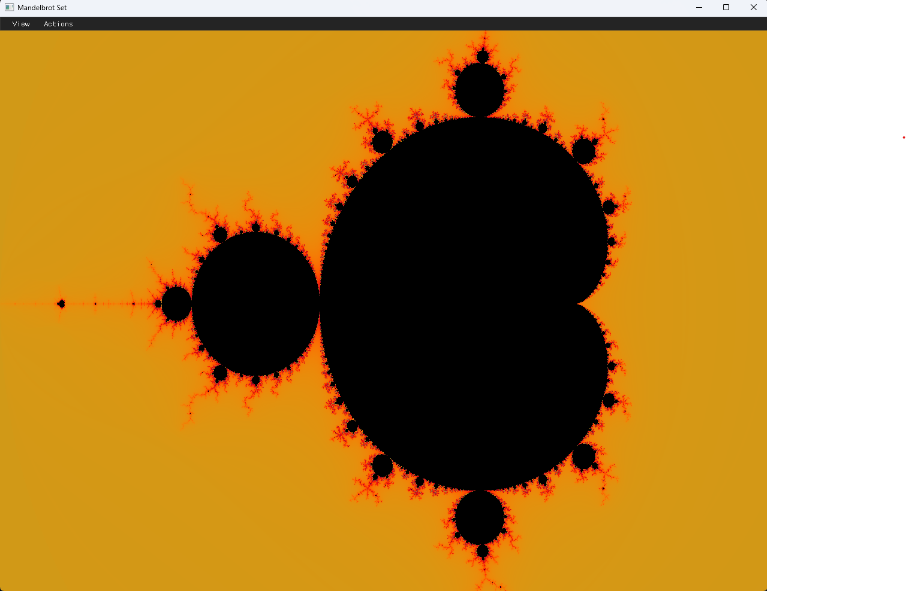

# Fractal Visualizer

A modern, interactive fractal visualization tool built with C++, OpenGL, and Dear ImGui. Explore the Mandelbrot set with real-time color controls, smooth zooming, and a beautiful dark interface.

## Features

### **Visual Controls**
- **6 Color Palettes**: Sine Wave, Grayscale, Rainbow, Blue-Orange, Fire, Ocean
- **Real-time Color Adjustment**: Scale and offset controls for fine-tuning
- **Smooth vs Discrete Coloring**: Toggle between smooth gradients and banded colors

### **Interactive Navigation**
- **Mouse Wheel**: Zoom in/out with smooth scaling
- **Left Click + Drag**: Pan around the fractal
- **Adjustable Zoom Speed**: Control how fast you zoom

### **Rendering Options**
- **Dynamic Iterations**: Adjust max iterations (10-2000) for detail vs performance
- **Reset View**: Return to default position and settings
- **Collapsible UI**: Hide/show control panels as needed

### **Modern Interface**
- **Dark Theme**: Sleek, modern dark interface
- **Floating Panels**: Draggable control windows
- **Menu Bar**: Easy access to view options and actions

## Screenshots

### Default View (Sine Wave Palette)


### Rainbow Palette


### Fire Palette


### Ocean Palette


### Zoomed Detail


### GUI Controls


## Quick Start

### Windows (Recommended)
1. **Install Dependencies**:
   ```powershell
   winget install Kitware.CMake
   winget install Git.Git
   winget install Microsoft.VisualStudio.2022.BuildTools
   ```
   Then open Visual Studio Installer and add "Desktop development with C++"

2. **Build & Run**:
   ```cmd
   # Open "x64 Native Tools Command Prompt for VS 2022"
   cd C:\path\to\Fractal_Visualizer
   cmake -S . -B build -G "NMake Makefiles" -DCMAKE_BUILD_TYPE=Release
   cmake --build build
   .\build\bin\fractal_visualizer.exe
   ```

### macOS
```bash
brew install cmake git
git clone <this repo>
cd Fractal_Visualizer
cmake -S . -B build -DCMAKE_BUILD_TYPE=Release
cmake --build build
./build/bin/fractal_visualizer
```

### Linux
```bash
sudo apt update
sudo apt install -y build-essential cmake git xorg-dev libglu1-mesa-dev
git clone <this repo>
cd Fractal_Visualizer
cmake -S . -B build -DCMAKE_BUILD_TYPE=Release
cmake --build build -j
./build/bin/fractal_visualizer
```

## Controls

| Action | Control |
|--------|---------|
| **Zoom In/Out** | Mouse Wheel |
| **Pan** | Left Click + Drag |
| **Toggle Color Panel** | View → Color Panel |
| **Toggle Parameter Panel** | View → Parameter Panel |
| **Reset View** | Actions → Reset View |

## Color Palettes

1. **Sine Wave** - Classic smooth gradients with phase shifts
2. **Grayscale** - Monochrome intensity mapping
3. **Rainbow** - Full spectrum color cycling
4. **Blue-Orange** - Warm/cool contrast palette
5. **Fire** - Red-orange-yellow heat mapping
6. **Ocean** - Blue-green underwater theme

## Technical Details

- **Language**: C++17
- **Graphics**: OpenGL 3.3 Core Profile
- **Window Management**: GLFW 3.3
- **UI Framework**: Dear ImGui 1.90
- **Math Library**: GLM 0.9.9
- **Build System**: CMake 3.14+

## Project Structure

```
Fractal_Visualizer/
├── src/
│   ├── main.cpp          # Application entry point
│   ├── Mandelbrot.cpp    # Fractal rendering logic
│   ├── Shader.cpp        # Shader management
│   └── GUI.cpp           # User interface
├── include/
│   ├── Mandelbrot.hpp    # Fractal class header
│   ├── Shader.hpp        # Shader class header
│   ├── GUI.hpp           # GUI class header
│   └── glad/             # OpenGL loader
├── shaders/
│   ├── mandelbrot.vert   # Vertex shader
│   └── mandelbrot.frag   # Fragment shader (fractal logic)
└── CMakeLists.txt        # Build configuration
```

## Future Enhancements

- Julia Set support
- Burning Ship fractal
- Save/load view settings
- Screenshot capture
- Performance optimization
- More color palettes

**Built with ❤️ by Tani**
